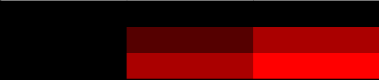
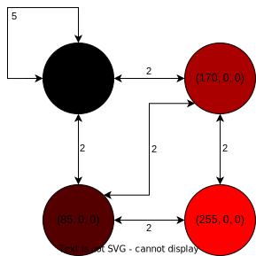
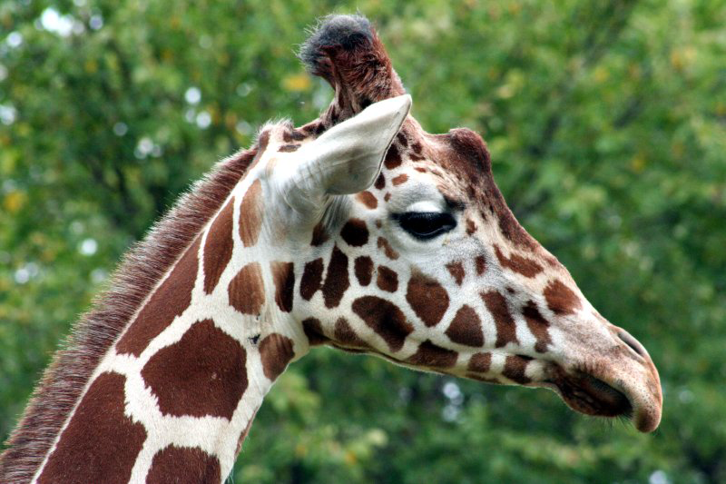

# psychic-giggle

## Abstract

In this project, I have attempted to Represent digital images (euclidean space as a graph in non-euclidean space. To create this mapping, I plan on making a finite set of nodes based on the (r, g, b) values. The edges will represent if the pixel is next to another node. These edges will have weights for how often the relationship is seen in the image. The theory is that in unaltered images, these physical relationships should indicate similarity, and any outliers are indicators of a change.

In an environment that is constantly becoming more online-centric, distinguishing truth from fiction is increasingly tricky. Online people try to control how they appear. Even more recently, AI-generated art has caused a stir as artists panic about the future. The ability to empirically tell if something is real/untampered or generated/edited would be crucial in using images as evidence.

### Other Solutions

- Adobe researchers (Creators of the Creative Cloud Suite [Photoshop]) trained a Convolutional Neural Network on faces edited using Photoshop's Face-Aware Liquify feature. This model can detect changes to faces and predict how the original looks. Many other papers took a similar approach to Adobe's researchers with CNN and RNN. Generally, these models get an accuracy of around 93% - 99% depending on the specifics.
- Beyond the Convolutional Neural Networks, more traditional methods of image forensics. Many of these methods look for a discrepancy in the edited image. (ex. shadows, natural skin flaws) These methods can be very subjective. One more empirical method for detecting changes is by looking at the Error Level Analyzer (ELA) algorithm. This method looks at how the image compares to the "original" when saved and preset qualities. If the image is original, each portion has been saved the same number of times. Specific parts will be saved at different levels with edits to the picture.

### Dataset

There are many private datasets for this problem. For this investigation I have selected a public dataset from Technische Fakultä as it contains 48 unedited images across four cameras. An added benefit to this dataset is the documented steps to create the altered images. Many current phones use automatic image processing to enhance the image fortunately these cameras do not contain this behavior.

### Expected Learning

There are two things that I expect to learn regarding this project:
1. Since this is very experimental, my understanding of euclidean and non-euclidean space will be increased. Due to the ordering of pixels, photos are in euclidean space; conversely, graphs, by nature, are not.
2. There are no papers on this specific approach, so I will build my graph network from scratch. I learn best by implementing concepts meaning my comprehension of graph neural networks will dramatically increase.

## Introduction

At a high level this project is looking at the relationship of pixels in a given image. Fundamentally all digital images are made up of pixels each of which contain a non-relevant number of channels. The number of channels is not relevant in this exploration since across an image they are uniform.

We start by creating a set (an un-ordered list of unique elements) of pixels. This reduction will give us all of our nodes for the graph. Similar to a set in python a dictionary also ensures no duplicates. We use this data structure to store keep the neighbor nodes. In taking the image from euclidean space into a graph representation we transform the spacial relations into non-euclidean features.

A toy example is as follows Image A is a photo where each cell represents an individual pixel. 

By looking at all the neighbors for each unique pixel color we can get an adjacency matrix.

From this matrix we can build a graph with each unique pixel value as a node and the relationships as edges. Specifically we are saving the weights to be used in averaging later.

|             | (0, 0, 0) | (170, 0, 0) | (85, 0, 0) | (255, 0, 0) |
|-------------|:---------:|:-----------:|:----------:|:-----------:|
| (0, 0, 0)   | 5         | 2           | 2          | 0           |
| (170, 0, 0) | 2         | 0           | 2          | 2           |
| (85, 0, 0)  | 2         | 2           | 0          | 0           |
| (255, 0, 0) | 0         | 2           | 2          | 0           |

## Methods

A majority of this project is pre-processing the data. As described in the Introduction we are taking an image file and turning it into a dictionary. This process of iterating over every pixel can be a very time consuming process. Creating the initial dictionary has a time complexity of O(n^2) for square images and O(n*m) where n is width and m is height. For a fairly standard image size of 1920 x 1080 there are 2,073,600 pixels being accessed. Beyond the time requirements, the process of converting an image to a dictonary or adjacency matrix takes up an increased amount of space. Below is a table for an arbitry image sample.jpg which demonstrates the space challanges. From our investigation saveing the dictionary as a pikle file provided an acceptiable tradeoff between space and access time. 

| File           | Size    | Size \[MB\] |
|----------------|---------|-------------|
| sample.jpg     | 98   kB | 0.098       |
| sample.jpg.csv | 5.99 GB |  5990       |
| sample.jpg.npy | 16.1 GB | 16100       |
| sample.jpg.pkl | 18.1 MB | 18.1        |

For the actual analysis of an image we are currently taking the weighted average of all the neighbor values of a pixel. This method is very similar to the manual calculations done by page rank algorithm where each node's importance is calculated by its neighbors. After calculating the new pixel color we look how many other nodes have been converted to the same color. The more nodes that have been averaged to the same color the higher the likelyhood of an edited region. 

## Results

In this exploration we didn't recive numerical data. The most striking result was with the Giraffe image. 

This is the origional image from the image dataset.

The same dataset provided an edited image where one of the spots were moved.

Coloring the outlyers with orange we get the following image in which we can see where the natural ratio was altered. Around these places we can clearly see where the edits were made.

## Conclusion

In conclusion this early exploration of pixel relationships bolsters well for a potential Graph Machine Learning project. Due to time constraints and the need to work with full images we were unable to complete a model before the end of the term. As there is little in terms of utilizing a graph ml structure to analyze photos we would classify this project as a success.

## References

Dataset URL: https://lme.tf.fau.de/dataset/image-manipulation-dataset/
